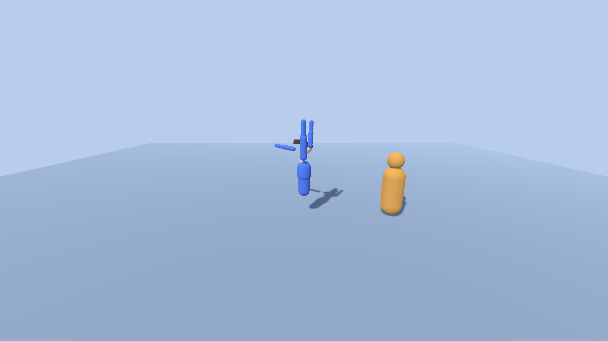

# godot-avatar-skeleton — Godot 4 纯代码人形骨架与 IK 原型



用 Godot 4 搭的一个**正常人比例人形骨架原型**——按骨架数值从脚底量到头顶约 **1.85m**
（计算过程见 §7.4 第 1 条，代码注释和旧 README 里写的 1.72 / 1.75m 都对不上）。三个子系统：

1. **部件化换装** —— 骨架由「关节节点 + 可替换的部件节点」组成，换 Mesh / 换色 / 挂武器
2. **双骨解析式 IK** —— 手臂与腿各是一条两骨链，末端跟随目标点，极向量控制肘/膝朝向
3. **程序化连招** —— 打斗动画不依赖动画剪辑，由状态机每帧**写出双手的目标世界坐标**

三个子系统的耦合方式是这个原型唯一值得看的地方：
`CombatSystem` 只负责"手应该到哪"，`TwoBoneIK` 只负责"让手臂够到那"，`main.gd` 每帧把两者接起来。
没有 Animator、没有 AnimationPlayer、没有混合树。

---

## 1. 运行

### 1.1 第一次跑必须先让 Godot 扫描一次项目（否则跑不起来）

**干净克隆直接跑命令行会失败。** 实测（把仓库复制成一个不含 `.godot/` 的干净副本）：

```
$ Godot_v4.7.2-stable_win64_console.exe --headless --path . --quit-after 120

SCRIPT ERROR: Parse Error: Could not find type "Humanoid" in the current scope.
   at: GDScript::reload (res://scripts/main.gd:7)
SCRIPT ERROR: Parse Error: Could not find type "PartSwapper" in the current scope.
SCRIPT ERROR: Parse Error: Could not find type "CombatSystem" in the current scope.
SCRIPT ERROR: Parse Error: Could not find type "DummyTarget" in the current scope.
SCRIPT ERROR: Parse Error: Identifier "Humanoid" not declared in the current scope.
   ... （共 18 条 SCRIPT ERROR）
ERROR: Failed to load script "res://scripts/main.gd" with error "Parse error".
```

**退出码仍然是 0**，但游戏根本没起来（`[AvatarSkeleton] ready` 一行都不会打印）。

原因是 GDScript 的 `class_name` 全局注册表缓存在 `.godot/global_script_class_cache.cfg`，
而 `.gitignore` 排除了 `.godot/`。干净克隆里没有这个缓存，
所以 `main.gd` 里的 `var humanoid: Humanoid` 这类类型引用全部解析失败。

**修法（任选一个）：**

```powershell
# A. 让 Godot 以编辑器身份扫描一次（会生成 .godot/，不改任何源文件）
Godot_v4.7.2-stable_win64_console.exe --headless --path . --import
```

或者 **B. 用 Godot 编辑器打开这个目录**（打开就会扫描），之后 F5 正常。

做完 A 或 B 之后，三个命令就都能跑了：

```powershell
# 无头冒烟检查（不弹窗、跑完退出）
Godot_v4.7.2-stable_win64_console.exe --headless --path . --quit-after 120
# → [PartSwapper] 套装: 士兵
# → [AvatarSkeleton] ready. 操作: WASD移动 / Space攻击 / ...

# 自动截图：跑到第 40 帧截图写 preview.png，然后退出
Godot_v4.7.2-stable_win64_console.exe --path . -- --shot
# → [Main] screenshot saved -> res://preview.png
```

我实测确认：**只做非编辑器的运行（GUI 或 headless）不会自动生成这个缓存**，
必须走 `--import` 或编辑器。也就是说 1.1 这个坑不是"第一次启动慢"，是**硬阻塞**。

> 截图那条**不能加 `--headless`**（无头渲染拿不到 viewport 纹理）。
> 另外 `--shot` 是 `--` 之后的**用户参数**，用 `OS.get_cmdline_user_args()` 读（`main.gd:22`）。

### 1.2 环境要求

- Godot 4.7（`config/features` 是 `PackedStringArray("4.7", "Forward Plus")`，
  用的是 **Forward+** 渲染器，**需要 Vulkan 支持**）
- 跑 `--shot` 需要能创建窗口的桌面环境

## 2. 操作

| 键 | 功能 | 位置 |
|---|---|---|
| `W`/`A`/`S`/`D` | 移动（方向相对相机） | `main.gd::_handle_movement` |
| `Space` | 攻击（0.7s 内连按 = 3 连击） | `combat.gd::attack` |
| `←` / `→` | 旋转练习靶（角色自动面向它，IK 跟随） | `main.gd::_rotate_dummy` |
| `Q` / `E` | 环绕视角 | `main.gd:85-88` |
| `1` / `2` / `3` | 换套装配色（士兵 / 武者 / 运动） | `part_swapper.gd::apply_outfit` |
| `G` | 换装备：无 → 剑 → 锤 → 剑+盾 | `part_swapper.gd::cycle_weapon` |
| `H` | 换头型（球头 / 方块头） | `part_swapper.gd::cycle_head_shape` |
| `T` | 开/关 手臂 IK + 头部注视 | `main.gd:76-77` |
| `F` | 开/关 脚部 IK（地面贴合 + 走路抬腿） | `main.gd:79-80` |

## 3. 骨架约定（换真实模型时的对接点）

骨架在 `humanoid.gd::_build()` 里纯代码构建。**每个关节是一个 `Node3D`**，
约定「关节的局部 +Y 指向它的子关节」，所以视觉部件的胶囊从关节原点沿 -Y 伸展
（`_part(name, joint, length, radius, color)`，`humanoid.gd:129`）。

```
hips → spine → chest → neck → head
chest → shoulder_L/R → upperarm_L/R → forearm_L/R → hand_L/R
hips  → hip_L/R      → thigh_L/R    → shin_L/R    → foot_L/R
```

各段长度（从 `_joint()` 的局部坐标读出来的）：

| 段 | 长度 (m) | 段 | 长度 (m) |
|---|---|---|---|
| `hips` 离地 | 0.98 | `thigh_L/R` | 0.44 |
| `spine` | 0.20 | `shin_L/R` | 0.41 |
| `chest` | 0.20 | `foot_L/R` | 0.05 |
| `neck` | 0.14 | `shoulder` 横向 | ±0.21 |
| `head` 关节 | 0.09 | `hip` 横向 | ±0.10 |
| `upperarm` | 0.29 | `forearm` | 0.27 |
| `hand` | 0.11 | | |

- **IK 链**：`shoulder→upperarm→forearm`（末端是腕）+ `hip→thigh→shin`（末端是踝）
- **换装**：`BodyPart.slot_id` + `PartSwapper`；`OUTFIT_PARTS` 11 个部件、`BOOT_PARTS` 2 个
- **头型**：换的是 `head` 部件的 Mesh（`swap_mesh`），球头 `radius=0.125` / 方块头 `0.24×0.28×0.22`
- **武器**：挂在 `hand_r` / `hand_l` 关节下的 `held_*` 节点，`_clear_held()` 先清旧的再挂新的
  （剑 = 3 个 box，锤 = 圆柱 + box，盾 = 1 个 box）

### 双骨 IK 的实现（`two_bone_ik.gd`，57 行）

解析解，不迭代：

```
a = |upper→lower|, b = |lower→end|, c = |upper→target|
if c > a+b : 钳制到全伸状态（够不到就伸直，不抖）
cos_a = (a² + c² − b²) / (2ac)     → ang_a = acos(cos_a)      # 余弦定理
axis  = normalize(base_dir × pole_dir)                        # 肘/膝所在平面
elbow = 两个镜像解里离 pole 更近的那个                          # 自然弯曲方向
align_y(upper, elbow − upper)
align_y(lower, target − lower)
align_y(end,   target − end)
```

`align_y()` 把节点的局部 +Y 轴对准目标方向：`Basis.looking_at(d, u) * Basis(RIGHT, −π/2)`。
它有一处**退化保护**——当 `|d·up| > 0.95`（腿骨竖直向下就是这种情况）时自动换一个垂直轴当 up
（`two_bone_ik.gd:13-18`）。另外 `pole` 与链方向共线时也换轴，避免叉积退化成零向量。

## 4. 程序化连招（`combat.gd`，118 行）

状态机 `IDLE → WINDUP → STRIKE → RECOVER`，每帧把两只手的目标世界坐标
写进 `right_target` / `left_target`，由 `main.gd::_apply_arm_ik()` 喂给 IK。

| 常量 | 值 | 含义 |
|---|---|---|
| `WINDUP_TIME` | 0.10 s | 起手 |
| `STRIKE_TIME` | 0.22 s | 命中窗口 |
| `RECOVER_TIME` | 0.16 s | 收招 |
| `COMBO_WINDOW` | 0.7 s | 超过这个空闲时间连击清零 |
| `HIT_RADIUS` | 0.42 m | 命中判定半径 |

- **一次挥击只命中一次**：`_hit_check` 用 `hit_this_swing` 布尔兜住，
  在整个 STRIKE 阶段反复调用也只 emit 一次 `on_hit`
- **挥砍中不可打断**：`attack()` 只在 `IDLE` 和 `RECOVER`（且 `t > 0.05`）时生效
- **轨迹是算出来的**：`_windup_pos()` → `_windup_end(aim)` 之间 `lerp`，
  叠一条 `sin(p·π)·0.30` 的抬升形成弧线（`_swing_arc`）
- **待机有呼吸感**：IDLE 时用 `Time.get_ticks_msec() * 0.004` 驱动一个 `±0.03` 的摆动
- **命中反馈**：`main.gd::_on_hit` 让靶子闪白（`DummyTarget.hit()` 设 `flash=0.15`，
  用 `albedo_color.lerp(BASE, HIT, flash/0.15)` 插值）并沿背离方向推开 0.15m

脚部 IK（`main.gd::_apply_foot_ik`）做了两件事：

1. **地面贴合**：从踝关节向下打一条 0.8m 的射线（`PhysicsRayQueryParameters3D`，
   排除地面自身的 RID），把踝目标钳到 `hit.y + 0.06`
2. **走路抬腿**：`move_progress` 仅在移动时累加，左右腿相位差 π，
   抬升量 `max(0, sin(progress·5 + phase)) · 0.07`

头部注视（`_apply_head_look`）把目标点转到 `neck` 局部空间后算 yaw/pitch，
并**分别钳制到 ±1.2 / ±0.9 rad**——脖子不会拧过 90°。

## 5. 代码规模

7 个 GDScript 脚本，**共 740 行**：

| 文件 | 行数 | 职责 |
|---|---|---|
| `scripts/main.gd` | 234 | 装配 + 输入 + 相机 + 环境 + 手臂/脚部 IK + 头部注视 |
| `scripts/humanoid.gd` | 146 | 骨架构建（20 个注册关节 + 19 个注册部件 + 2 颗眼球） |
| `scripts/part_swapper.gd` | 121 | 换装：3 套配色 / 2 种头型 / 4 种装备状态 |
| `scripts/combat.gd` | 118 | 打斗状态机 + IK 轨迹连招 |
| `scripts/two_bone_ik.gd` | 57 | 解析式两骨 IK |
| `scripts/dummy_target.gd` | 39 | 练习靶（受击闪白，无物理碰撞） |
| `scripts/body_part.gd` | 25 | 部件最小单元（挂点 + 可替换 Mesh + 材质） |

场景只有一个：`scenes/main.tscn`（169 字节，只有一个挂了 `main.gd` 的 `Node3D`）。
**整个 3D 场景树是运行时用 `Node3D.new()` / `MeshInstance3D.new()` 搭出来的**
（角色、相机、地面、光源、WorldEnvironment 全在 `main.gd::_ready()` 与
`_setup_environment()` 里创建）。这就是"纯代码"的含义。

## 6. 依赖说明（重要）

### 6.1 动画资产来自第三方，未随仓库分发

本仓库的 `.gitignore` 明确排除了 `assets/animations/`：

```gitignore
# 第三方动画资产：体积过大(含 67MB .blend)且自带嵌套 .git，不随仓库分发
# 需要者请自行获取 Godot4-OpenAnimationLibraries
assets/animations/
*.blend
*.blend1
```

**`assets/animations/` 目录下的动画库（`Godot4-OpenAnimationLibraries`）不是我做的，
也不在这个仓库里。** 需要动画剪辑的人请自行获取该第三方库。

我核对过当前代码：**没有任何脚本加载 `assets/animations/` 下任何东西**。
目前的角色动作全部是 `combat.gd` 每帧算出来的 IK 目标点轨迹，不是播放的动画剪辑。

### 6.2 `assets/models/` 里有两个我用不上的模型

`assets/models/` 下有 `Fox.glb`（162,852 B）、`Fox_0.png`（26,764 B）、
`RiggedFigure.glb`（50,116 B），以及它们的 `.import` 文件。它们是**其它来源的第三方模型**，
在当前代码里**完全没被引用**：

```
$ grep -r "Fox\|RiggedFigure\|load(\|preload(" scripts/
（只命中 README 里的一句说明，脚本零命中）
```

保留它们只是作为"换成真实模型时的参考素材"。如果不打算用，删掉可以让仓库更干净；
**但请知道它们是第三方资产，不是这个原型的一部分。**

## 7. 已知边界 / 未完成

### 7.1 资产与"零外部资产"的口径

原 README 开头写的是「**零外部资产**（模型/贴图/动画全部由代码生成），开箱即跑」。
我核对后的准确说法是：

- **角色的几何、材质、配色、动作全部由代码生成** —— 这部分属实，
  `humanoid.gd` / `part_swapper.gd` / `combat.gd` / `dummy_target.gd` 没有一个加载外部资源。
- **但"零外部资产"作为仓库级陈述不成立** —— 仓库里确实带着两个第三方 `.glb` 模型
  （§6.2），以及一个被 `.gitignore` 排除的第三方动画库（§6.1）。
  这两件事必须在 README 里说清楚，否则读者会以为动画和模型也是从零写的。

### 7.2 运行证据（我实际跑过的）

在测试机上用 `Godot_v4.7.2-stable_win64_console.exe` 实跑过，结论写在这里：

| 验证项 | 结果 |
|---|---|
| 干净副本（无 `.godot/`）+ `--headless --quit-after 120` | **失败**：18 条 `SCRIPT ERROR`，`main.gd` 加载失败，游戏没起来（但退出码是 0）。见 §1.1 |
| 干净副本 + 非无头 `--quit-after 120`（GUI 路由） | **同样失败**，18 条 `SCRIPT ERROR`，也**不会**生成 `.godot/` |
| 干净副本 + `--import`（编辑器扫描） | 成功生成 `.godot/global_script_class_cache.cfg`，里面注册了 6 个 `class_name`：`BodyPart` / `CombatSystem` / `DummyTarget` / `Humanoid` / `PartSwapper` / `TwoBoneIK` |
| 扫描后再跑 `--headless --quit-after 120` | **成功**，0 条 `SCRIPT ERROR`，打印 `[PartSwapper] 套装: 士兵` 与 `[AvatarSkeleton] ready.` |
| 扫描后跑 `--path . -- --shot` | **成功**，打印 `[Main] screenshot saved -> res://preview.png`，重新生成的 `preview.png` 是 **36,933 B** |

关于 `preview.png`：仓库里那份是 1152×648 / **36,329 B**，我重新生成的是 **36,933 B**，
两者只差 604 B（≈1.7%）。这基本可以确认**仓库里那张图就是这套代码 + `--shot` 的产物**，
不是手工拼接的。我读过它的画面内容：浅蓝背景、蓝色胶囊人形、双臂抬起、
右手附近有一小截深色条状物、右侧橙黄色胶囊练靶带球头，角色脚下有投影。
不过**它是默认状态（无装备、球头、套装 1）**——我无法从图里看出更细的按键状态。

### 7.3 明确的功能缺口

- **肢体是胶囊 + 方块拼的"积木人"**，不是蒙皮网格。`BodyPart` 的 `swap_mesh()`
  只换 Mesh，**没有骨骼绑定/Skin 的概念**（`humanoid.gd:3` 的注释就写着
  "纯代码生成、零外部资产"）。所谓"关节"只是 `Node3D`，不是 `Skeleton3D` 的 bone。
- **命中判定是纯距离检测**：`hand.distance_to(aim) < HIT_RADIUS`，没有碰撞体、
  没有伤害数值、没有受击方向（`dummy_target.gd:3` 自己承认"无物理碰撞"）。
- **练习靶不会还手**：`DummyTarget` 只有 `hit()` 和闪白，没有 AI、没有血条。
- **角色没有受击 / 死亡状态**：`CombatSystem` 只管出招，没有任何 hp 字段。
- **没有奔跑 / 跳跃 / 蹲下**：`main.gd` 的移动是平面上的匀速位移（`SPEED = 2.2`），
  没有重力、没有 `CharacterBody3D`——角色根节点就是裸的 `Node3D`，
  直接 `global_position += dir.normalized() * SPEED * delta`（`main.gd:181`），**会穿墙**。
- **没有动画剪辑混合**，也没有 Motion Matching。换真动画是"下一步"，
  当前是 IK 轨迹程序化动画。
- **没有网络同步**。
- **没有音频、没有 UI、没有存档**。
- **`main.gd` 承担了太多职责**：装配、输入、相机、环境、两种 IK、头部注视全在一个 234 行的
  `_process` 驱动的脚本里。它是这个原型里最先需要拆分的文件。

### 7.4 文档与代码的实际不一致（我逐条核对过）

| # | 原 README / 注释说 | 代码实际是 |
|---|---|---|
| 1 | 「正常人比例（约 **1.75m**）角色」（旧 README）与 `humanoid.gd:3` 注释「约 **1.72m** 高」 | 按骨架数值逐段加（`humanoid.gd:34-60`）：`hips 离地 0.98` + `spine 0.20` + `chest 0.20` + `neck 0.14` + `head 关节 0.09` = **head 关节在 1.61m**；再算头部球体（`position.y = 0.10`、`radius = 0.125`）⇒ **头顶约 1.835m**；头发球（`0.175 + 0.14/2`）⇒ **约 1.855m**。脚底方块最下沿在 `0.98−0.44−0.41−0.05−0.035−0.035 = 0.01m`，所以**脚底到头顶约 1.85m**。两个文档数字都比实际矮 0.1m 以上。另外**眼球中心算出来正好是 1.725m**——我猜「1.72m」是当初按视平线写下的，不是身高，但没有证据 |
| 2 | 「零外部资产（模型/贴图/**动画**全部由代码生成）」（旧 README） | 见 §7.1。仓库带 2 个第三方 `.glb` + 1 个被排除的第三方动画库。`.gitignore` 里那句注释才是准确表述，README 正文与它直接矛盾 |
| 3 | `scripts/` 树里列出 7 个文件（`body_part` / `combat` / `dummy_target` / `humanoid` / `main` / `part_swapper` / `two_bone_ik`） | **属实，7 个 `.gd` 全对**，行数也与实际一致（25/118/39/146/234/121/57）。这处没有出入，写在这里是因为它是我核对的项里少数完全对得上的 |
| 4 | 命令行验证 `--quit-after 120` 是无头冒烟测试 | 截图那条（`--shot`）在 `main.gd:54` 是 `if _auto_shot and _frame == 40`，**跑满 40 帧就 `get_tree().quit()`**，所以 `--quit-after` 对它没有意义。120 对无头检查有效（不加会一直挂着），但两条命令性质不同，旧 README 没说明；它给的那条截图命令也没写 `--headless`（截图确实不能无头，但没写原因） |
| 5 | 「IK 链：`shoulder→upperarm→forearm`（两骨）、`hip→thigh→shin`（两骨），末端手/脚跟随目标点」 | 属实。但**两条链的 `end` 语义不同**：手臂链传的是 `forearm_r/l`（`main.gd:113,116`），腿链传的是 `shin`（`main.gd:141`）。旧 README 的层级图把 `hand_L/R` / `foot_L/R` 画成链的一环，实际它们是 `align_y` 的**被动跟随端**，不是 IK 求解的输入 |
| 6 | 「打斗状态机：IDLE→WINDUP→STRIKE→RECOVER」 | 属实且完整。但旧 README 漏了最该写的一点：**这套东西的接缝是"世界坐标"**。`CombatSystem` 每帧输出 `Vector3` 双手目标点，`main.gd` 把 `Vector3` 喂给 IK。想换成真动画剪辑时这个接缝的语义会整个变掉（动画给的是骨骼旋转，不是 IK 目标点）——这是最该写进 README 的架构约束 |
| 7 | `scripts/` 那个目录树叫 `godot_avatar_skeleton/`（下划线） | 实际目录名是 `godot-avatar-skeleton`（连字符）。同样的小问题在 `concept-animator` 仓库里造成了"包名不可导入"的硬故障，这个仓库因为不涉及 Python 导入所以无害，但两处命名不一致仍值得统一 |
| 8 | 「零外部资产……**开箱即跑**」 | **"开箱即跑"是错的，而且是硬阻塞**：干净克隆上 `--headless` 和非无头命令行**都跑不起来**（18 条 `SCRIPT ERROR`，`main.gd` 加载失败，退出码却仍是 0），必须先 `--import` 或用编辑器打开一次让 Godot 注册 `class_name`。详见 §1.1 与 §7.2 |
| 9 | 「本机 4.7.2 验证」 | 这句是真的，我复现了——**但只在 `.godot/` 已生成之后**。旧 README 的作者显然是在自己已经扫描过的目录里验证的，所以没发现第 8 条 |

另外，`project.godot` 的注释写「Godot 4.x (tested with 4.7)」，
而 `config/features` 是 `PackedStringArray("4.7", "Forward Plus")`、
`rendering_method = "forward_plus"`。同一个机器上的 `rogue-dshrl` 用的是
`gl_compatibility`。Forward+ 需要 Vulkan，**在没有 Vulkan 的机器（老显卡、纯 RDP、部分 VM）
上跑不起来**，README 里没提这个要求；如果只是想要一个能到处跑的原型，
`gl_compatibility` 是更省事的默认值。

还有一处两种 Godot 版本行为差异值得留意：我用 `--import` 扫描 `rogue-dshrl` 之外的这个项目时，
第一次运行在收尾阶段以 `exit=-1073741819`（Windows `STATUS_ACCESS_VIOLATION`，即段错误）结束，
但 `.godot/` 已经正常生成、后续运行也正常。第二次就干净退出了。
所以如果你在 CI 里看到这个退出码，先检查 `global_script_class_cache.cfg` 是否生成成功，
不要直接判定失败。

### 7.5 下一步（如果继续做）

按投入产出排序：

1. 把 `main.gd` 拆成 `CharacterController` / `CameraRig` / `IKRig` 三个脚本
2. 角色根节点换成 `CharacterBody3D`，让移动有碰撞（现在会穿墙）
3. 用 `Skeleton3D` + 蒙皮网格替换胶囊部件——`BodyPart.swap_mesh()` 这个接缝已经预留好了
4. `assets/models/Fox.glb` / `RiggedFigure.glb` 二选一保留作参考，其余清理掉
5. 命中判定从距离检测换成 `Area3D`，补伤害数值
6. 想接第三方动画库时，注意 §6.1 的 `.gitignore` 规则——别把 67MB 的 `.blend` 提交进去

---

## 关于 AI 辅助

本仓库的代码与文档均在**大量 AI 辅助**下完成（Claude Code / DeepSeek Harness 等 agent 工具，
协作方式是「人定方向与验收标准，AI 执行与自查，人逐项核对」）。README 本身也是 AI 起草、人工核对后的产物。

写这一节不是为了免责，而是因为**这就是它真实的工作方式**，而且它解释了这个仓库的一些特征：

- 每个数字都要求有出处（代码、日志或 `docs/evidence/`），**查不到就标「未核实」**
- 多处被推翻的早期说法**保留在「已知边界」里**，没有悄悄删掉
- 交付前做过机器核查，修掉过几处写错的声明

> 判断与把关是人做的，AI 承担执行与自查。
